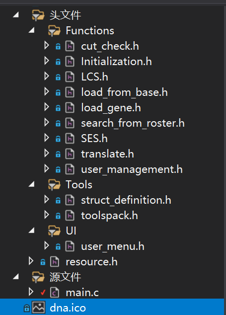
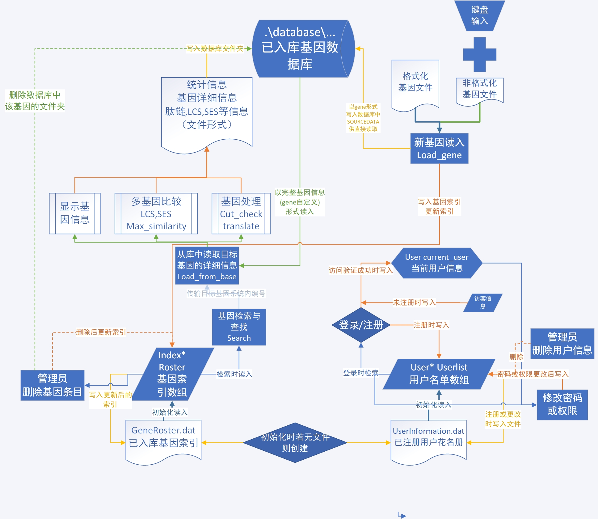
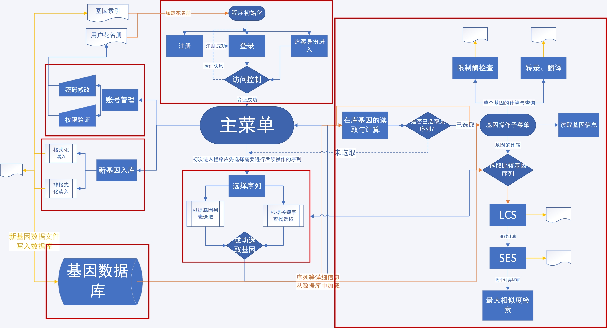
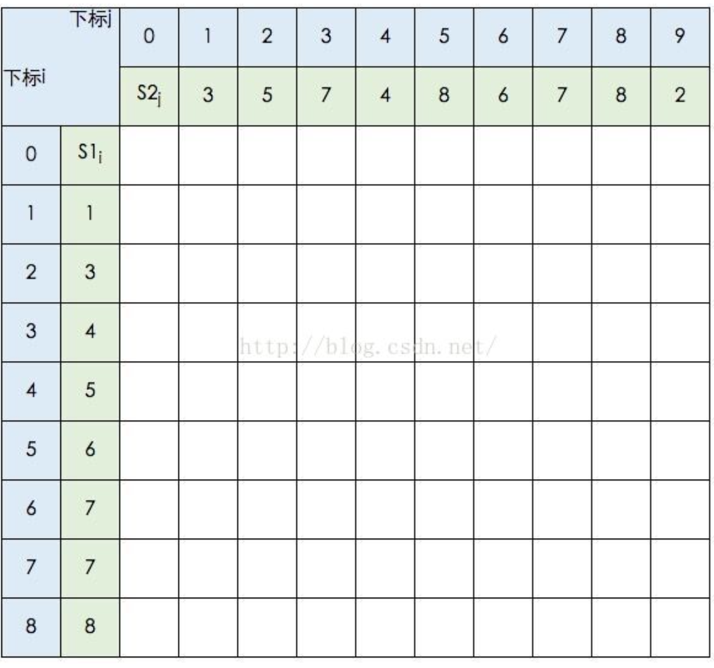
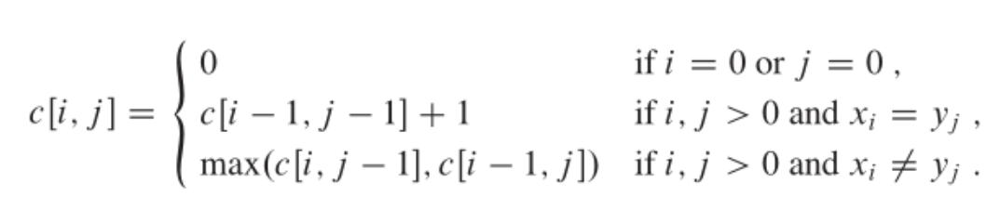

# Genesflow–RNA病毒基因共享平台 程序设计文档

> The Only Thing We Have to Fear is Fear Itself. 			——Franklin Delano Roosevelt
******

## 1 程序概要

### 1.1 简介

#### 项目性质

本项目是黄维通老师《计算机程序设计基础》课程期末大作业第一题，任务1到任务5的汇总形式。

是一个基于C语言开发，通过命令行界面实现的精简版**RNA病毒**数据库及共享平台。

主要面向**新冠病毒（SARS-CoV-2）**的基因序列管理与各类操作，同时兼容其余大部分RNA病毒序列。

N.B. 程序仅经过小范围鲁棒性测试，可能存在巨量目前尚未发现的bug，敬请留意。

#### 开发信息

- IDE：程序基于Microsoft Visual Studio 2019 Professional平台编写并调试通过，为x64版本。

- 开发者：清华大学 材02 陈方弈（学号：2020011392）

  微信：SekiroYoumu；邮箱：chenfang20@mails.tsinghua.edu.cn

- 开发周期：5/21/2021—5/30/2021

- Github Repo: [SekiroYoumu/THU-2021-Newbie-Assignment: 一次入门级的程设作业，献丑 (github.com)](https://github.com/SekiroYoumu/THU-2021-Newbie-Assignment)

### 1.2 程序功能介绍

#### 1）在库基因查询与计算

* 在库基因序列索引的列表与各类关键字查询；
* 在库基因序列的限制酶位点检查与记录；
* 在库基因序列的转录及翻译，肽链文档的输出；
* 在库基因序列的比较：LCS（最长公共子序列）与SES（最少操作次数）计算；
* 基于SES最小为度量方式的基因相似度比对与“最相似基因”的查找；
* 上述操作的简单输入控制。

#### 2）新基因入库

* 新基因的格式化文本读入；
* 新基因的非格式化文本读入（手动读入）；
* 读入后基因的统计信息与详细信息的文本创建；
* 入库时的简单判错机制。

#### 3）机构账号创建与管理

* 访问控制：账户的注册与登录系统；
* 进入系统时可选的最低权限未注册访客模式；
* 基于“确认码”的用户提交基因权限许可机制；
* 程序内已注册账号的管理：修改密码与提交基因许可验证。

#### 4）全局账户管理与基因条目管理（管理员only）

- 当前在库任意账户的信息查看与列表；
- 修改在库任意账户的密码与访问权限；
- 删除在库任意账户与在库任意基因条目信息。

###### ~~其它：加载界面“可可爱爱”的字符画，治好十年强迫症的选择界面排版，没什么用的日期显示，亲切的问候语~~

## 2 整体架构

### 2.1 文件架构

#### 2.1.1 代码文件



包括3个筛选器，其中有15个代码文件（1个源文件与14个头文件）；以及程序图标资源文件。如上图所示。

`main.c`仅仅是简单地对主菜单与初始化函数作了调用，此略。

以下为头文件内容：

1)`user_menu.h`中包括所有菜单函数以及他们的互相调用。

2）`\Functions`筛选器中的头文件包含本项目绝大部分主要功能函数。见后文介绍。

3）`Tools`中`struct_definition.h`包含所有结构体、枚举变量、自定义与全局变量的定义。

4）`toolspack.h`是工具函数的打包，包含以下内容，请参见后续“函数接口”

		- 归并排序等数据处理函数；
		- 打印到屏幕等文件操作函数；
		- 字符（字符串）处理函数；
		- 提取索引信息，用户/基因条目列表等主系统功能相关的函数；
		- 杂项：等待后清屏、获得本地时间等。

5）`resource.h`与.ico文件用来给程序加上好看的图标。

#### 2.1.2 程序文件

程序运行需要生成或调用一个文件夹，3个文件。
│  GeneRoster.dat 
│  Genesflow v1.3.exe （程序本体）
│  loading_screen.dat
│  UserInformation.dat
├─genebase

基因数据库文件夹，内有已入库的所有基因信息与执行操作后生成的文件。

初始化界面文件。

基因与用户花名册文件。初始化时调用（若不存在则重新生成)

#### 2.1.3 其他文件

1）测试基因文件：位于TESTFILE文件夹中。有格式化文件与非格式化文件（二者已在README中说明）。

2）格式化文件示例。

3）面向一般用户的程序执行流程图，以visio文件形式保存。

4）程序说明书（README.md）及其附件。

5）程序设计文档（Development.md）及其附件。

### 2.2 结构体、枚举、自定义与全局变量说明

见`struct_definition.h`代码旁的注释，此附：

```c
/*1.枚举与结构体的定义汇总*/
enum authentication_enum
{
	GUEST=-1,UNAUTHED, AUTHED, ROOT
};
//用户权限的四个等级，-1对应访客，0对应无权限提交基因组序列，1对应有权限提交基因组序列，2对应管理员
enum month_name_enum
{
	JAN=1,FEB,MAR,APR,MAY,JUN,JUL,AUG,SEP,OCT,NOV,DEC
};
enum read_formate
{
	FORMATTED,MANUAL
};//基因组文件的读入格式，0代表格式化文件自动识别，1代表非格式化文件手动读入
typedef struct date_information
{
	int y;
	int m;
	int d;
}date;//日期结构体
typedef struct full_gene_information
{
	int id; //系统内唯一ID（按顺序排列）
	char ID[15];	//DNA序列唯一ID
	char name[200]; //DNA序列名称
	char type[30]; //DNA序列类型
	char seq[40000]; //DNA序列体
	int a, t, c, g, l; //统计信息（l为总长度）
	char source[200];//DNA序列的来源病毒类型
	char locale[200]; //采集地点
	char ins[150]; //测序机构
	char tech[70];//测序技术
	char remark[200]; //其他附加信息
	date submit;
}gene;//完整的DNA序列信息
gene null_gene = { 0,"-1","-1", "-1", "-1", -1,-1,-1,-1,-1,"-1", "-1", "-1", "-1", "-1", -1,-1,-1 };
typedef struct sequence_with_length
{
	char* seq;
	int l;
}seq_len;//定义“带长度的DNA序列”，方便数据传递及开空间
seq_len null_seq = { NULL,-1 };
typedef struct Gene_index_information 
{
	int id;
	char name[200];
	char ID[15];
	char type[30];
	char source[200];//DNA序列的来源病毒类型
	char locale[200]; //采集地点
	char ins[150]; //测序机构
	char tech[70];//测序技术
}index;//在库序列索引
typedef struct user_information
{
	int user_id;
	char password[17];
	char user_name[100];
	int privilege;
}user;//用户信息
typedef struct amino_acid
{
	char name[4];
	int n;
}amino;//氨基酸信息
/*2.全局变量定义汇总*/
int current_id = 0; //当前选中基因的id
int compare_id = 0; //进行LCS,SES等操作时选择
index* roster = NULL;//入库基因数组
user* userlist = NULL;//入库用户数组
user current_user; //当前账户参数
user guest = { -1,"RickAstley","访客",-1 };//访客用户参数
user admin = { 0,"thucfy","admin",2 };//管理员用户参数，重新建立数据库时启用
int sum_user = 0;//当前入库用户总数(不包括管理员账户！）
int sum_roster = 0;//当前入库基因总数
const char not_allowed[10] = "/\\:*?\"<>|";//创建文件不允许的字符，会在录入基因时检查
const char auth_key[20] = "GlobalFirstTieUniv.";//权限开启验证码
```

### 2.3 数据流与文件流

如以下流程图所示。[^1][^2]



[^1]:图例：蓝色线——以数组形式传输；橙色线——内存写入；黄色线——文件写入；绿色线——以基因完整信息(gene)形式传输；灰蓝色线——以系统内唯一id(int)形式传输；虚线——删除。
[^2]:采用Microsoft Visio 2019绘制。

*Markdown格式显示较小，可打开根目录下“数据流与文件流.vsdm“查看。*

### 2.4 程序执行流程[^3][^4]



[^3]: 图例：蓝色线——用户调用的流程；黄色线——写入文件；橙色线——读取文件；红色方框——子菜单的整体。
[^4]: 采用Microsoft Visio 2019绘制。

## 3 函数接口

以下以头文件为顺序简述各函数功能与接口。

函数的具体实现方式已以注释的形式详细地标在源代码旁，请直接查看。

### 3.1 功能函数

- `Initialization.h`：程序初始化函数`void Initialize()`
  
  - 加载初始化界面字符画。
  
  - 加载（若不存在则创建）在库基因索引与已注册用户信息名单
  
  - 调用注册`int registration`与登录`int login`（在`user_management.h`中），进行访问验证。
  
    返回1时表明验证通过，允许进入主界面。
  
- `load_from_base.h`：包含从库中加载基因函数`gene load_from_base(int id, int t)`
  - id表示需加载函数的唯一编号；t=0时表示用户调用，t=1时表示其他函数调用（静默模式）
  - 从数据库中SOURCEDATA读取结构体存储的基因信息，并以gene结构体返回。

- `load_gene.h`：包含新基因序列入库函数`int load_gene(const char *p, int method)`
  - *p记录基因文件的名称（或相对路径），method=0表示格式化读入，method=1表示非格式化读入。
  - 读入基因后会计算碱基个数并将标准格式的基因文件与SOURCEDATA文件保存至对应目录。

- `cut_check.h`：包含限制酶切割位点检查函数`void cut_check(int id)`
  - 形参是目标基因的唯一序号。函数执行后位点信息将以文件形式保存在对应目录。

- `translate.h`：包含cDNA转录、翻译与氨基酸数量排序的函数。
  - `char* transcribe(int id)` 转录过程，从cDNA获得+RNA，以首地址指针形式返回。
  - `int translate(int id)` +RNA翻译过程模拟。翻译后结果以文件形式保存在对应目录。
  - `void q_sort_amino(amino* l, amino* r)`基于快速排序法的氨基酸数量排序。氨基酸以结构体数组形式存储，本函数输入其首尾地址。

- `LCS.h`与`SES.h`：包含计算LCS，SES，以及最大相似度比对的函数。

  - `seq_len LCS(int id1, int id2,int t)` 根据所选基因与比较基因的序号进行LCS计算。算法为参考资料给出的动态规划算法（Dynamic Planning, DP)，具体实现见代码旁的解释。

    1）二维动态数组开辟空间。



​			（2）根据递推反向推得序列本身。[^5]

[^5]:以上两幅示意图来自[动态规划 最长公共子序列 过程图解_hrn1216的博客-CSDN博客_最长公共子序列](https://blog.csdn.net/hrn1216/article/details/51534607)

- `int SES(int id1,int id2,int t) ` 

  通过调用LCS函数计算SES，SES=“seq.t1-LCS”(切割)+“seq.t2-LCS”(插入)，具体实现见代码旁的解释。

- `int max_similarity(int id)`

  选一个基因（以序号呈现）在库中逐对计算SES，取SES最小者为最大相似度基因。具体实现见代码旁的解释。

- `search_from_roster.h` 包含基因库关键字查找函数`int search()`

  - 可以指定六种关键字，并在多个结果中筛选。返回值为最终选中函数的序号。

### 3.2 账号管理函数

`user_management.h`：包含账户管理与访问验证函数

- `int login()` 登录。成功返回1，失败返回0.
- `int registration()` 注册+将新用户信息写入UserInformation.dat，成功返回1，失败返回0.
- `void password_change()`更改密码。管理员与一般用户公用，管理员调用时可以改所有账户密码。
- `void auth_change() `更改权限。管理员与一般用户公用，管理员调用时可以改所有账户权限。
- `void print_userlist()` 打印包括密码在内的所有用户信息。管理员及调试时使用。
- `void user_delete()` 删号。管理员及调试时使用。

### 3.3 菜单函数

`user_menu.h`：其中包含了主菜单以及几乎所有子菜单函数。

*(基因提交除外，其菜单与读取为统一函数)*

主菜单与子菜单函数除实现选择支之外，还实现输入的初步筛选以及权限的访问限制。

具体实现参见代码注释。

主菜单：`void main_menu()`

子菜单：

- `void admin_menu() `管理员菜单

- `void search_menu(int target)`基因选定菜单 

  (target=1代表选择目标基因，target=2代表选择比较基因)

- `void gene_lookup_menu()` 基因计算与处理菜单

- `void account_menu()` 一般用户的账号管理菜单。

### 3.4 工具~~人~~函数

`toolspack.h`：包含了所有工具函数。

- 数据处理类
  - `int* merge_sort(int r[], char d[][10])` 归并排序（以前写的，目前尚未用到）。
  - `int maxinum(int a, int b)`&`int mininum(int a, int b)`值的比较。
- 文件处理类
  - `void file_connect(FILE* s, FILE* t)` 文件链接。
  - `void file_print(char *p)`文件打印到屏幕。
- 函数功能相关
  - `void indexualize(gene* load,index* get)` 从完整基因信息中获得索引信息。
  - `void print_roster()` 输出所有在库基因序列。
- 字符串处理
  - `char* strlower(char* str)` 将字符串中字母全部变为小写。
- 杂项
  - `void wait()` 等待后清屏
  - `void get_time(date* today)`获取当前本地日期并以date结构体类型返回。

## 4 开发日志

#### 21.5.22 v0.50 

主要算法函数（对应大作业说明文档中的任务1至任务4）完工。

根据后续需要搭建了工具函数。

#### 21.5.26 v0.90 

平台账号管理系统完工并通过初步测试。

#### 21.5.27 v1.00 

所有函数接口完工，将所有函数的接口统一修改成整型数“唯一id”。

#### 21.5.27 v1.10 

完整的平台架构建成。

#### 21.5.27 v1.20 

修复了基因名中包含“\”或“/”等Windows创建文件不支持的符号导致崩溃的bug。

根据现实基因信息加长了基因信息结构体的存储空间。

第一次Release。

#### 21.5.28 v1.30 

屏幕输出排版，大幅优化界面显示效果与内容。

发现乐VS2019不支持fflush(stdin)，通过查资料决定用rewind(stdin)替代。

解决上述命令失效导致清空缓冲区失败使菜单选择出错得问题。

增加了几个菜单的返回上级菜单方式。增加了进入程序时可选的低权限访客模式。

#### 21.5.28 v1.31 

添加了第一部分的代码注释。

添加了程序图标（by Sirius_Neo，特此致谢)。

#### 21.5.28 v1.32 

全部代码注释加注初步完成。

做了一些可能无法被察觉的优化与修复。

第二次Release。

小范围鲁棒性测试 ~~炸酒馆~~。感谢参与程序测试的舍友与高中同学。

#### 21.5.29 v1.33 

源代码一度因未知原因丢失，后通过回滚找回。~~午夜惊魂.jpg~~

将工程上传了Github。修改了主菜单界面的按钮顺序。

添加了格式化上传基因文件时的初步格式验证，部分修复了格式错误导致崩溃的bug。

~~修复了，但没有完全修复，只修复了一点点.jpg~~

程序使用说明书与程序说明文档撰写完毕。

## 5 致谢

- 本基因共享平台程序是清华大学黄维通老师《计算机程序设计基础》C语言课程大作业。

  衷心感谢黄老师能提供大作业这一挑战自我的平台与机会，在编写过程中我收获颇丰。

- 衷心感谢上海交通大学Sirius_Neo(真名隐去)指导我初次使用Github，并为本程序提供了图标：

  ​														 

  ​							  			↑这是一个很帅气的DNA双螺旋。

- 这是我首次使用Visual Studio 2019平台编写程序，其有很多语法特性与操作方式与我惯用的Dev-C++不同。

  衷心感谢吉林大学SDDF(真名隐去)对Visual Studio 2019的特性提供介绍与讲解，使我少走了许多弯路。

- 衷心感谢东北大学Val Thalas(真名隐去)提供启动界面字符画的制作方法。

- 衷心感谢程序编写完成后参与或即将参与小范围鲁棒性测试（~~帮我炸酒馆找bug~~）的以下同学(真名隐去)：

  上海交通大学 Sirius_Neo

  东北大学 Val Thalas

  吉林大学 SDDF

  南开大学 yg

  清华大学 For_Violet

  清华大学 SJZ

  清华大学 SekiroYoumu ~~我自己~~

- 衷心感谢我的高中同学们，他们在我实在写不下去代码的时候勉励了我，让我有动力继续~~加班~~写下去。

- 除大作业要求文档给出的参考文献外，编写过程中参考的其他网络资料：

  [动态规划 最长公共子序列 过程图解_hrn1216的博客-CSDN博客](https://blog.csdn.net/hrn1216/article/details/51534607)

  [解决关于VS2017无法使用flush(stdin)的问题_学习记录-CSDN博客](https://blog.csdn.net/weixin_43074474/article/details/89528424)

  [如何创建你的ico图标（一个含有多种尺寸的ico）_毒来毒往-CSDN博客_](https://blog.csdn.net/dldw777/article/details/83119217)

  [fread读取结构体注意事项_u011639069的专栏-CSDN博客](https://blog.csdn.net/ana1yst/article/details/84597499)

  [fwrite乱码问题_空白的博客-CSDN博客](https://blog.csdn.net/qq_45624989/article/details/105750800)

  [C语言中的格式控制符_流承钧的博客-CSDN博客_](https://blog.csdn.net/somanlee/article/details/62056101)

  [scanf()正则表达式的使用 - 橙&子 - 博客园 (cnblogs.com)](https://www.cnblogs.com/orange1438/archive/2013/05/12/4544958.html)

  [National Center for Biotechnology Information (nih.gov)](https://www.ncbi.nlm.nih.gov/)

  [C 语言教程 | 菜鸟教程 (runoob.com)](https://www.runoob.com/cprogramming/c-tutorial.html)

