# Genesflow–RNA病毒基因共享平台 使用说明书

> The Only Thing We Have to Fear is Fear Itself. 			——Franklin Delano Roosevelt
******

## 1 程序概要

### 1.1 简介

#### 项目性质

欢迎使用！本程序是一个基于C语言开发，通过命令行界面实现的精简版**RNA病毒**数据库及共享平台。

主要面向**新冠病毒（SARS-CoV-2）**的基因序列管理与各类操作，同时兼容其余大部分RNA病毒序列。

N.B. 程序仅经过小范围鲁棒性测试，可能存在巨量目前尚未发现的bug。*游览时请记得全程佩戴安全帽哦：）*

#### 开发信息

开发者&管理员：清华大学 材02 陈方弈（学号：2020011392）

微信：SekiroYoumu；邮箱：chenfang20@mails.tsinghua.edu.cn

开发周期：5/21/2021—5/30/2021

Github Repo: [SekiroYoumu/THU-2021-Newbie-Assignment: 一次入门级的程设作业，献丑 (github.com)](https://github.com/SekiroYoumu/THU-2021-Newbie-Assignment)

### 1.2 功能介绍

#### 在库基因查询与计算

* 在库基因序列索引的列表与各类关键字查询；
* 在库基因序列的限制酶位点检查与记录；
* 在库基因序列的转录及翻译，肽链文档的输出；
* 在库基因序列的比较：LCS（最长公共子序列）与SES（最少操作次数）计算；
* 基于SES最小为度量方式的基因相似度比对与“最相似基因”的查找。

#### 新基因入库

* 新基因的格式化文本读入；
* 新基因的非格式化文本读入（手动读入）；
* 读入后基因的统计信息与详细信息的文本创建。

#### 机构账号创建与管理

* 访问控制：账户的注册与登录系统；
* 进入系统时可选的最低权限未注册访客模式；
* 基于“确认码”的用户提交基因权限许可机制；
* 程序内已注册账号的管理：修改密码与提交基因许可验证。

#### 全局账户管理与基因条目管理（管理员only）

- 当前在库任意账户的信息查看与列表；
- 修改在库任意账户的密码与访问权限；
- 删除在库任意账户与在库任意基因条目信息。
###### ~~其它：加载界面“可可爱爱”的字符画，治好十年强迫症的选择界面排版，没什么用的日期显示，亲切的问候语~~

## 2 程序操作说明

写在前面：

所有输入”字符串“型的输入框均可通过输入**”exit“**返回上级菜单。

所有输入”整型数“型的输入框均可通过输入**任意其他数字**返回上级菜单。

具体参见输入前的提示。

### 2.1 程序操作流程（非管理员用户）

一般用户的使用流程如下图所示。[^3][^4]

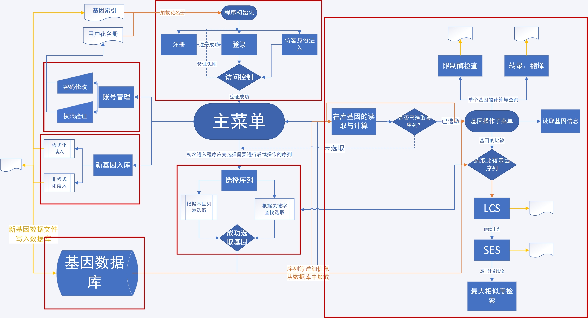

[^3]:图例：蓝色线——用户调用的流程；黄色线——写入文件；橙色线——读取文件；红色方框——子菜单的整体。
[^4]:采用Microsoft Visio 2019绘制。

*Markdown格式显示较小，可打开根目录下“流程.vsdm“查看。*

### 2.2 访问控制与账户管理

#### 2.2.1 用户权限说明

本系统根据（1）是否有新基因上传的权限（2）是否为管理员（3）是否为未注册访客，将用户权限分为四级：

| 用户类型   | 权限等级[^1] | 在库基因查看与检索 | 翻译与限制酶检查 | LCS,SES,基因相似度 | 新基因提交 | 本账户管理 | 管理员命令[^2] |
| ---------- | ------------ | ------------------ | ---------------- | ------------------ | ---------- | ---------- | -------------- |
| 未注册访客 | GUEST(-1)    | ✔                  | X                | X                  | X          | X          | X              |
| 未验证账户 | UNAUTHED(0)  | ✔                  | ✔                | ✔                  | X          | ✔          | X              |
| 已验证账户 | AUTHED(1)    | ✔                  | ✔                | ✔                  | ✔          | ✔          | X              |
| 管理员     | ROOT(2)      | ✔                  | ✔                | ✔                  | ✔          | ✔          | ✔              |

[^1]:权限等级在源代码中由枚举类型定义。
[^2]:管理员可用命令包括查看任意账户信息，修改任意账户密码与访问权限，删除账户与基因信息等，具体功能见后。
> 附录1  调试期可供使用的示例账号：
>
> ​				账号						密码
>
> 管理员	admin					thucfy
>
> 已验证	TsinghuaUniv.		THU
>
> 未验证	JiaLiDunUniv.		 JLDU
>
> 访客       请直接选择3进入系统即可。

#### 2.2.2 注册与登录

初始化后，根据选择支选择注册或登录。

##### 1）注册

若您尚未拥有账号，则应当选择注册，流程如下图。

**注意：注册过程中请特别注意提示中对机构名与密码的要求！**

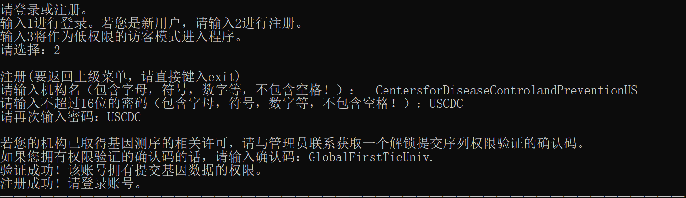

注册完成后，为验证您所在的机构是否具有提交基因序列的许可，需要您提供一个确认码，如图所示。

若确认码正确，则该账号权限会被设置为AUTHED(1)，可以调用后续与基因上传有关的函数。

若确认码错误，则该账号权限会被设置为UNAUTHED(0)，不可以调用后续与基因上传有关的函数。

若您的机构拥有相关许可，请与开发者（见1.1）联系，获取该确认码。

> 附录2  调试期权限验证确认码
>
> GlobalFirstTieUniv.

##### 2) 登录

若您已拥有账号，则可直接选择登录，流程如下图。

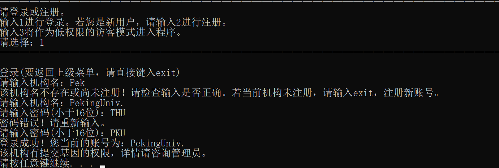

登录成功后与主界面菜单上方均会显示当前帐号是否经过验证，敬请留意。

##### 3) 访客

若您希望以未注册的访客身份登录本系统，请选择3。

注意：访客身份权限低（为GUEST(-1)）、许多操作受限而无法执行。具体见前述说明。

#### 2.2.3 程序内账户管理

如下图，根据提示进入当前账户管理界面。

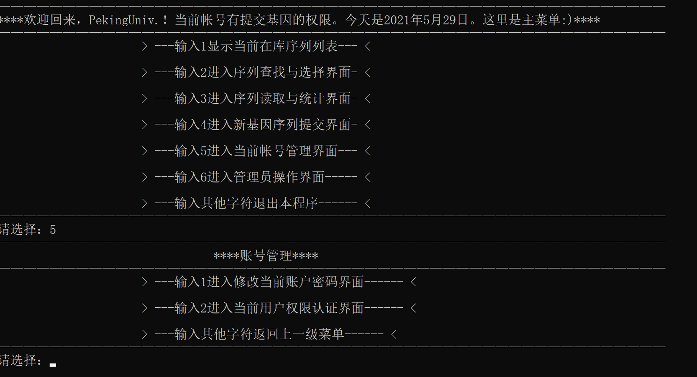

* 输入1修改密码。

* 在和管理员取得许可并获得确认码后，**未验证账户**可输入2进行重新验证。验证过程与”注册”部分相仿。

  *已验证用户无需重复验证。*

### 2.3 在库基因检索与选择

**选项3中序列计算与统计前必须先选定一条基因序列！**

在主菜单中输入2选项可进入。可选从列表中直接挑选或关键字查找两种方式选择。

#### 2.3.1 从列表中选择

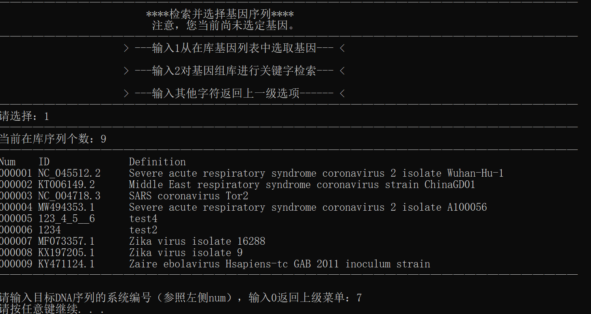

系统将打印当前在库所有基因序列，每个序列都有系统内唯一编号（参照左侧“Num”)，通过输入系统编号选择。

#### 2.3.2 关键字检索与筛选

系统对每种基因序列的信息都做了索引，可根据名称，ID等进行关键词检索，具体支持条目如下。

选择后进入查找界面，输入关键字（不区分大小写）即可进行查找。如下图所示。

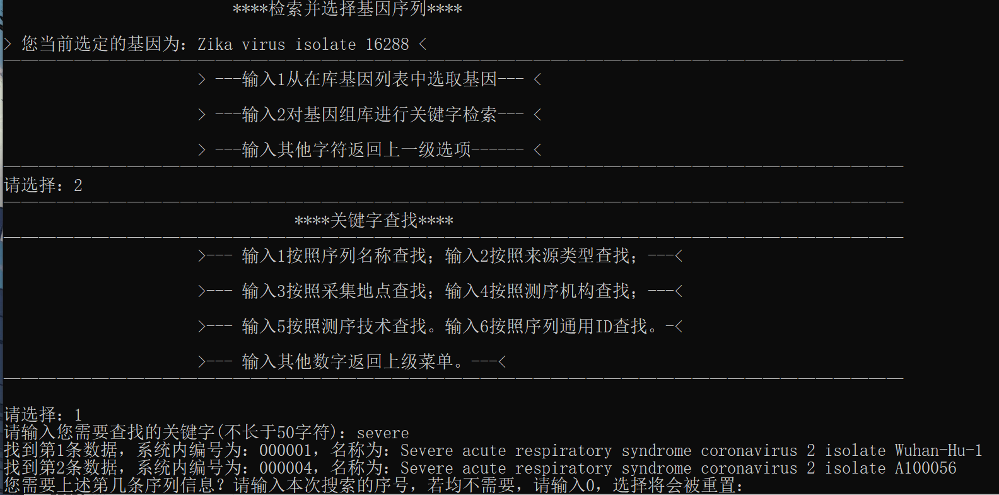

若检索到多条记录，则可根据**本次检索的序号**选择所需基因。

若没有搜索到所需结果，可输入0，选择将被重置。

请注意：在完成基因选择后，基因选择与基因操作子菜单上方会显示当前选中的基因，如下图。请注意核对。

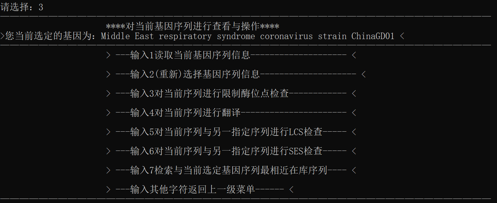

### 2.4 基因序列的计算与处理

**再次强调，进行选项3中序列计算与处理前必须先通过选项2选定一条基因序列！**

#### 2.4.1 基因序列处理功能简述

参照1.2程序功能所述，本系统提供多样化的RNA病毒基因检查功能，包括：

* 在库基因序列的限制酶位点检查与记录；

* 在库基因序列的转录及翻译，肽链文档的输出；

* 在库基因序列的比较：LCS（最长公共子序列）与SES（最少操作次数）计算；

* 基于SES最小为度量方式的基因相似度比对与“最相似基因”的查找。

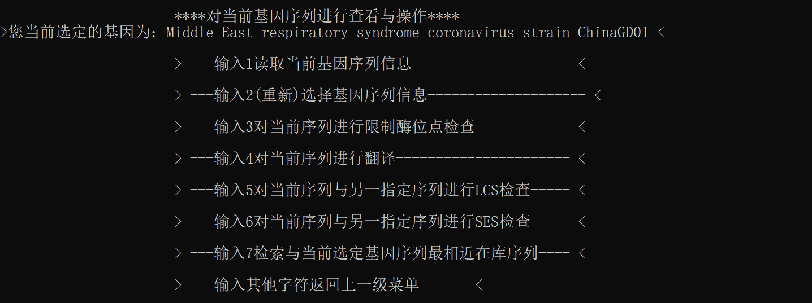

如上图所示。

**注意：LCS,SES与最大相似度查找与计算用时较长，耗费算力与内存空间较大！**

**请保证当前设备拥有4G以上空闲内存空间。执行过程中，请耐心等待。**

*开发者设备上，最大相似度计算约用时10×当前基因条目数量（s），供参考。*

#### 2.4.2 基因序列处理的文件查看

请参照执行操作后系统所给的提示获取信息与统计文件。

各功能统计文件均保存在.\genebase\\(基因ID)文件夹中，文件格式如下图所示。

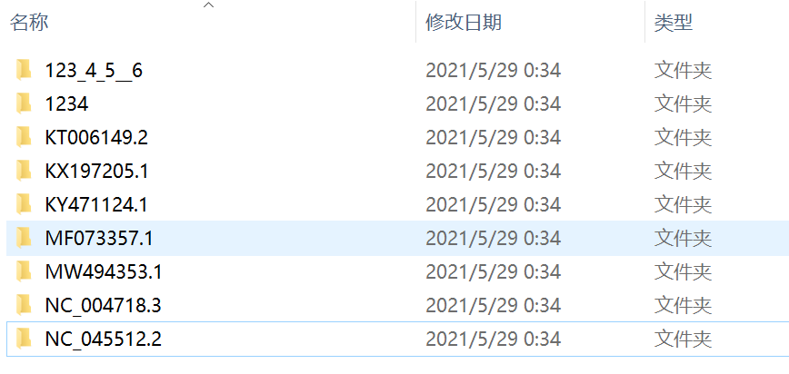

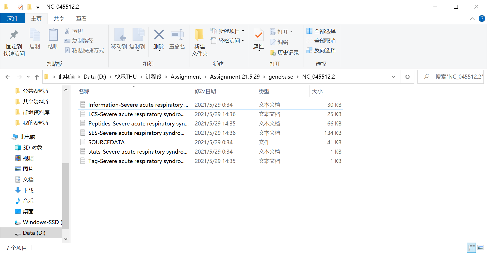

> 附录3  已入库完毕的9条示例基因序列如下：
>
> Num    ID              			Definition
> 000001 NC_045512.2     Severe acute respiratory syndrome coronavirus 2 isolate Wuhan-Hu-1
> 000002 KT006149.2       Middle East respiratory syndrome coronavirus strain ChinaGD01
> 000003 NC_004718.3     SARS coronavirus Tor2
> 000004 MW494353.1     Severe acute respiratory syndrome coronavirus 2 isolate A100056
> 000005 123_4_5__6     	test4
> 000006 1234            	    test2
> 000007 MF073357.1       Zika virus isolate 16288
> 000008 KX197205.1        Zika virus isolate 9
> 000009 KY471124.1        Zaire ebolavirus Hsapiens-tc GAB 2011 inoculum strain
>
> 可在测试程序时调用。

### 2.5 新基因序列入库

如果您所在的机构已通过确认码认证，则有权向本系统提交新基因序列。

提交新序列分为格式化文件（包含所有信息）与非格式化文件（仅含碱基序列）两种方式进行，可根据实际选择。

读入操作请根据下述信息与系统内提示进行。

#### 2.5.1 格式化文件读入

一份格式化文件包含了基因录入所需的所有信息。我们参考GenBank的完整序列信息构建了简化的格式。

若需以格式化文件方式读入，请**严格按照下述格式**编辑文件并放在根目录（或其他路径，需在录入文件时输入**相对路径**），否则可能导致无法录入或信息出错。

示例如下：

>\>NC_045512.2*（基因ID）*,Test Gene Information*（基因名）*,complete genome*（基因类型）*
>SOURCE:12345678*（基因来源）*
>LOCALE:12345678*（基因采集地点）*
>INSTITUTION:12345678*（基因测序机构）*
>SequencingTechnology:12345678*（基因测序技术）*
>REMARK:
>1234*（其他有关信息）*
>ATTAAAGGTTTATACCTTCCCAGGTAACAAACCAACCAACTTTCGATCTCTTGTAGATCTGTTCTCTAAA
>CGAACTTTAAAATCTGT……*(cDNA序列。换行、空格、数字等不用删除，可带行标也可不带行标)*

#### 2.5.2 非格式化文件读入

非格式化文件读入即手动读入，您需将**只包含cDNA序列本体**的文件置于根目录（或其他路径，需在录入文件时输入**相对路径**）。其他信息将从键盘读入，根据系统提示输入即可。

### 2.6 管理员命令

若“成功”提交了错误的基因信息或注册了错误账号，可联系管理员删除。管理员命令功能如下。

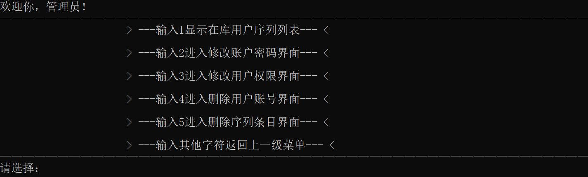

## 3 开发与更新日志

#### 21.5.22 v0.50 

主要算法函数（对应大作业说明文档中的任务1至任务4）完工。

根据后续需要搭建了工具函数。

#### 21.5.26 v0.90 

平台账号管理系统完工并通过初步测试。

#### 21.5.27 v1.00 

所有函数接口完工，将所有函数的接口统一修改成整型数“唯一id”。

#### 21.5.27 v1.10 

完整的平台架构建成。

#### 21.5.27 v1.20 

修复了基因名中包含“\”或“/”等Windows创建文件不支持的符号导致崩溃的bug。

根据现实基因信息加长了基因信息结构体的存储空间。

第一次Release。

#### 21.5.28 v1.30 

屏幕输出排版，大幅优化界面显示效果与内容。

发现乐VS2019不支持fflush(stdin)，通过查资料决定用rewind(stdin)替代。

解决上述命令失效导致清空缓冲区失败使菜单选择出错得问题。

增加了几个菜单的返回上级菜单方式。增加了进入程序时可选的低权限访客模式。

#### 21.5.28 v1.31 

添加了第一部分的代码注释。

添加了程序图标（by Sirius_Neo，特此致谢)。

#### 21.5.28 v1.32 

全部代码注释加注初步完成。

做了一些可能无法被察觉的优化与修复。

第二次Release。

小范围鲁棒性测试 ~~炸酒馆~~。感谢参与程序测试的舍友与高中同学。

#### 21.5.29 v1.33 

源代码一度因未知原因丢失，后通过回滚找回。~~午夜惊魂.jpg~~

将工程上传了Github。修改了主菜单界面的按钮顺序。

添加了格式化上传基因文件时的初步格式验证，部分修复了格式错误导致崩溃的bug。

~~修复了，但没有完全修复，只修复了一点点.jpg~~

程序使用说明书与程序说明文档撰写完毕。

## 4 致谢

- 本基因共享平台程序是清华大学黄维通老师《计算机程序设计基础》C语言课程大作业。

  衷心感谢黄老师能提供大作业这一挑战自我的平台与机会，在编写过程中我收获颇丰。

- 衷心感谢上海交通大学Sirius_Neo(真名隐去)指导我初次使用Github，并为本程序提供了图标：

  ​														 

  ​							  			↑这是一个很帅气的DNA双螺旋。

- 这是我首次使用Visual Studio 2019平台编写程序，其有很多语法特性与操作方式与我惯用的Dev-C++不同。

  衷心感谢吉林大学SDDF(真名隐去)对Visual Studio 2019的特性提供介绍与讲解，使我少走了许多弯路。

- 衷心感谢东北大学Val Thalas(真名隐去)提供启动界面字符画的制作方法。

- 衷心感谢程序编写完成后参与或即将参与小范围鲁棒性测试（~~帮我炸酒馆找bug~~）的以下同学(真名隐去)：

  上海交通大学 Sirius_Neo

  东北大学 Val Thalas

  吉林大学 SDDF

  南开大学 yg

  清华大学 For_Violet

  清华大学 SJZ

  清华大学 SekiroYoumu ~~我自己~~

- 衷心感谢我的高中同学们，他们在我实在写不下去代码的时候勉励了我，让我有动力继续~~加班~~写下去。

- 除大作业要求文档给出的参考文献外，编写过程中参考的其他网络资料：

  [动态规划 最长公共子序列 过程图解_hrn1216的博客-CSDN博客](https://blog.csdn.net/hrn1216/article/details/51534607)

  [解决关于VS2017无法使用flush(stdin)的问题_学习记录-CSDN博客](https://blog.csdn.net/weixin_43074474/article/details/89528424)

  [如何创建你的ico图标（一个含有多种尺寸的ico）_毒来毒往-CSDN博客_](https://blog.csdn.net/dldw777/article/details/83119217)

  [fread读取结构体注意事项_u011639069的专栏-CSDN博客](https://blog.csdn.net/ana1yst/article/details/84597499)

  [fwrite乱码问题_空白的博客-CSDN博客](https://blog.csdn.net/qq_45624989/article/details/105750800)

  [C语言中的格式控制符_流承钧的博客-CSDN博客_](https://blog.csdn.net/somanlee/article/details/62056101)

  [scanf()正则表达式的使用 - 橙&子 - 博客园 (cnblogs.com)](https://www.cnblogs.com/orange1438/archive/2013/05/12/4544958.html)

  [National Center for Biotechnology Information (nih.gov)](https://www.ncbi.nlm.nih.gov/)
  
  [C 语言教程 | 菜鸟教程 (runoob.com)](https://www.runoob.com/cprogramming/c-tutorial.html)

